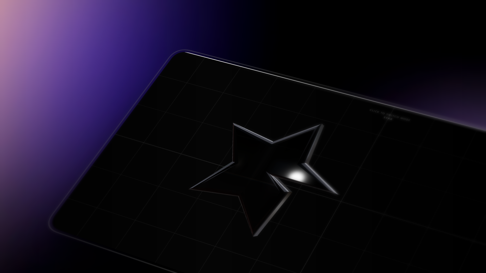

# Refract Cursor 🫧🔍💎

Una experiencia de cursor 3D ultra-premium construida con **React Three Fiber** y **Three.js**. Este proyecto transforma el puntero estándar en un lente de vidrio físico que refracta y distorsiona el contenido de la pantalla con una fluidez asombrosa.



## 🌟 Características Principales

*   **Refracción de Vidrio Real:** Simulación física de luz usando `MeshTransmissionMaterial` para una distorsión realista del fondo.
*   **6 Modos Interactivos:** Cambia entre diferentes geometrías 3D con un solo click:
    *   `Lens` (Lente clásica) 🫧
    *   `Cube` (Cubo geométrico) ⏹️
    *   `Star` (Estrella de 5 puntas) ⭐
    *   `Crystal` (Icosaedro diamante) 💎
    *   `Donut` (Toroide) 🍩
    *   `Pyramid` (Tetraedro) 🔼
*   **Iluminación Reactiva (Glow Tail):** Una luz puntual sigue al cursor con un ligero retraso, creando un destello dinámico que persigue al vidrio.
*   **RGB Split Dinámico:** Aberración cromática vinculada a la velocidad. Cuanto más rápido muevas el mouse, más se separan los colores.
*   **Squash & Stretch:** Físicas elásticas que deforman la figura según la dirección y velocidad del movimiento.
*   **100% Responsivo:** Las geometrías se ajustan automáticamente al tamaño de cualquier pantalla.

## 🚀 Tecnologías Usadas

*   **React 19**
*   **Three.js** (Motor 3D)
*   **React Three Fiber** (Puente React-Three)
*   **@react-three/drei** (Utilidades 3D)
*   **Maath** (Cálculos matemáticos y suavizado)
*   **Tailwind CSS** (Estructura de la UI)

## 🛠️ Instalación

1.  Clona el repositorio:
    ```bash
    git clone https://github.com/sebastianvasquezechavarria1234/refract-cursor.git
    ```
2.  Instala las dependencias:
    ```bash
    npm install
    ```
3.  Inicia el servidor de desarrollo:
    ```bash
    npm run dev
    ```

## 🎮 Cómo Usar

*   **Movimiento:** Desplaza el mouse para ver el efecto de refracción y deformación.
*   **Click Izquierdo:** Alterna entre los 6 modos de geometría disponibles.
*   **Click Derecho:** Deshabilitado para mejorar la experiencia inmersiva.

---

Creado con pasión por **Sebastian Vasquez Echavarria** 🚀💎
